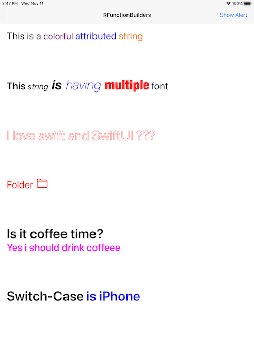
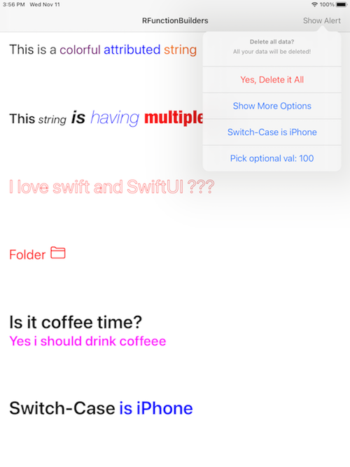

# RResultBuilders

![Build][bitrise-build-status]
[![Swift Version][swift-image]][swift-url]
[![License][license-image]][license-url]
[![Swift Package Manager][spm-image]]()
![Xcode][xcode-image]
[![Platform][platform-image]]()

``RResultBuilder`` is DSL library based on [Result Builder](https://github.com/apple/swift-evolution/blob/main/proposals/0289-result-builders.md)
- [Features](#features)
- [Requirements](#requirements)
- [Installation](#installation)
- [Usage](#usage)
- [Screenshot](#screenshot)
- [Example](#example)
- [Contribute](#contribute)
- [Meta](#meta)

## <a name="features" /> Features

- Supports
    - [`NSAttributedString`](#NSAttributedString)
    - [`UIAlertController`](#UIAlertController)
    - [`Request`](#Request)
- DSL way defining attributed string
- Building attributed strings is type safe
- DSL way of constructing ActionSheet, AlertController
- Swift 5.4 compatible
- Supports control statements(including optional checking) within DSL body builder
- Reduces boilerplate code
- Fully tested code
- Distribution with Swift Package Manager

## <a name="requirements" /> Requirements

- iOS 11.0+
- macOS 10.11+
- watchOS 4.0+
- Xcode 12.5+


## <a name="installation" /> Installation


#### Swift Package Manager
Just add this dependency in `Package.swift`
Open your project in Xcode 11, navigate to Menu -> Swift Packages -> Add Package Dependency and enter
``` swift
.package('https://github.com/rakutentech/ios-rresultbuilders', from: 1.0.0)
```

## <a name="AttributedString" /> NSAttributedString
Following components that helps in building attributed string in easy way
- **RText**: This component used to construct attributed text from given string
- **RLink**: This component used to construct link in attributed text
- **RImageAttachment**: This component used to construct image attachment in attributed text 
- **Miscelleneaous**
    - **REmpty**: Just empty component
    - **RSpace**: This component used to insert space and default is one space
    - **RLineBreak**: This component used to insert new line and default is one line break

##### Regular

```swift
import RResultBuilders
NSAttributedString {
    RText("I love swift and SwiftUI ???")
        .stroke(width: 2, color: .red)
}
.font(.systemFont(ofSize: 50))
```
 
 ##### Control statements
 
> If..else
```swift
import RResultBuilders

let optionalText: String? = "iPhone12 Pro Max"
NSAttributedString {    
    if let text = optionalText {
        RText(text)
            .font(.systemFont(ofSize: 20))
            .foregroundColor(.red)
    } else {
        RText("Optional else Text")
    }
}
.font(.boldSystemFont(ofSize: 40))
```
> switch..case
```swift
enum Apple { case iPhone, mac, airpod }
let appleDevice = Apple.iPhone
NSAttributedString {
    switch appleDevice {
    case .iPhone:
        RText("This is iPhone")
            .foregroundColor(.blue)
    default:
        RText("Apple future device")
    }
}
.font(.boldSystemFont(ofSize: 40))
```
> for..in loop
```swift
let appleDevices = [<.....>]
NSAttributedString {
    for device in appleDevices {
        RText(device.rawValue)
            .foregroundColor(device.color)
            .font(device.font)
        RSpace()
    }
}
.font(.boldSystemFont(ofSize: 40))
```

## <a name="UIAlertController" /> UIAlertController
There are dedicated actions those can be used to construct alert or action sheet
- **DefaultAction**: This action is default type with `UIAlertAction.Style` as default
- **CancelAction**: This action is cancel type with `UIAlertAction.Style` as cancel
- **DestructiveAction**: This action is destructive type with `UIAlertAction.Style` as destructive

##### Regular

```swift
import RResultBuilders
UIAlertController(
    title: "Delete all data?",
    message: "All your data will be deleted!") {
    DestructiveAction("Yes, Delete it All") {
        print("Deleting all data")
    }
    DefaultAction("Show More Options") {
        print("showing more options")
    }
    CancelAction("No, Don't Delete Anything")
}
```

##### With control statements

> If..else
```swift
import RResultBuilders

let optionalText: String? = "Show More optionals"
UIAlertController(
    title: "Delete all data?",
    message: "All your data will be deleted!") {
    
    // Optional unwrapping
    if let text = optionalText {
        DefaultAction(text) {
            print("showing more optionals")
        }
    }
    CancelAction("No, Don't Delete Anything")
}
```

> switch..case
```swift
let appleDevice = Apple.iPhone
UIAlertController(
    title: "Delete all data?",
    message: "All your data will be deleted!") {    
    // Switch case
    switch appleDevice {
    case .iPhone:
        DefaultAction("Show More iPhone") {
            print("showing more iPhone")
        }
    default:
        DefaultAction("Show More appleDevice") {
            print("showing more appleDevice")
        }
    }
    CancelAction("No, Don't Delete Anything")
}
```

> for..in loop
```swift
let actions = [<.....>]
UIAlertController(
    title: "Delete all data?",
    message: "All your data will be deleted!") {
    for action in actions {
        action
    }
}
```

## <a name="Request" /> Request
Making API call in declarative is fairly simple
### DSL
```swift
Request<Type> {
    URL("https://jsonplaceholder.typicode.com/todo")
}
.onObject { object in
    ...
}
.resume()
```

### Data Request
To get raw data as response
```swift
Request<Type> {
    URL("https://jsonplaceholder.typicode.com/todo")
}
.onData { data in
    ...
}
.onError { err in
    ...
}
.resume()
```

### Callback handler
You can attach all possible handlers to Request but they are completely optional execept `resume`
```swift
Request<[Todo]> {
    URL(string: "https://jsonplaceholder.typicode.com/todos")!
}
.onRawResponse { (data, response, error) in
    ...
}
.onData { data in
    ...
}
.onObject { todos in
    ...
}
.onError { err in
    ...
}
.resume()
```

### Request Components
##### URL
URL can also be build in DSL way
```swift
URL {
    Scheme(.https)
    Host("jsonplaceholder.typicode.com")
    Path("todo")            
}
```
##### Header
Supports standard HTTP headers
```swift
Header.Accept(.json)
Header.Authorization(.basic(username: "username", password: "password"))
Header.CacheControl(.noCache)
Header.ContentLength(16)
Header.ContentType(.json)
Header.Host(jsonplaceholder.typicode.com", port: "8000")
Header.UserAgent("user-agent")
Header.Custom("custom", value: "customvVal")
```
It also supports building Headers in DSL
```swift
Headers {
    Header.Accept(.json)
    Header.Authorization(.basic(username: "test", password: "rest"))
    Header.CacheControl(.noCache)
}
```

##### HTTP Body
Custom Encodable Object
```swift
Request<Type> {
    RequestBody(sampleTodo)
}
.resume()
```
Raw Data
```swift
Request<Type> {
    RequestBody(data)
}
.resume()
```

##### HTTP Method
```swift
Method.GET
Method.POST
Method.HEAD
Method.PUT
Method.DELETE
```

##### Timeout
```swift
Timeout(30) // seconds
```

##### Decoding
You can even specify custom decoder 
```swift
Request<[Todo]> {
    URL(string: "https://jsonplaceholder.typicode.com/todos")!
}
.onObject(using: JSONDecoder()) { todos in
    ...
}
.resume()
```

Also raw data can be decoded
```swift
DataRequest {
    URL(string: "https://jsonplaceholder.typicode.com/todos")!
}
..onData { data in
    data?.decoded()
    // Custom decoder
    // data?.decoded(using: JSONDecoder())
}
.resume()
```

##### URLRequest
It also generates raw URLRequest
```swift
DataRequest {
    URL(string: "https://jsonplaceholder.typicode.com/todos")!
    Method.GET
    CachePolicy(.reloadIgnoringLocalCacheData)
    Headers {
        Header.Accept(.json)
        Header.Authorization(.basic(username: "test", password: "rest"))
        Header.CacheControl(.noCache)
    }
}.asURLRequest()
```

## <a name="screenshot" /> Screenshot

 



## <a name="example" /> Example

- Open and Run the project inside Example folder and find various use cases


## <a name="contribute" /> Contribute

We welcome you for the contribution to ``RResultBuilders``, check the [CONTRIBUTING][contiribute-url].
If you find any issues or want to suggest your brilliant ideas please feel free to create pull request.


## <a name="meta" /> Meta

Distributed under the MIT license. See  [LICENSE][license-url] for more information.

[swift-image]: https://img.shields.io/badge/Swift-5.4%2B-orange
[swift-url]: https://swift.org/
[license-image]: https://img.shields.io/badge/License-MIT-blue.svg
[license-url]: https://github.com/rakutentech/ios-rresultbuilders/blob/master/LICENSE
[contiribute-url]: https://github.com/rakutentech/ios-rresultbuilders/blob/master/CONTRIBUTING.md
[pod-image]: https://img.shields.io/badge/pod-v1.0.0-blue
[platform-image]: https://img.shields.io/badge/Platform-iOS11.0%2B%20%7C%20macOS%2010.11%2B%20%7C%20watchOS%204.0%2B-orange
[xcode-image]: https://img.shields.io/badge/Xcode-12.5+-blue.svg
[spm-image]: https://img.shields.io/badge/Swift%20Package%20Manager-compatible-brightgreen.svg
[bitrise-build-status]: https://app.bitrise.io/app/bb96d52540c9e3ea.svg?token=yt1Mv147hXKe4v9FznfLNQ&branch=master


